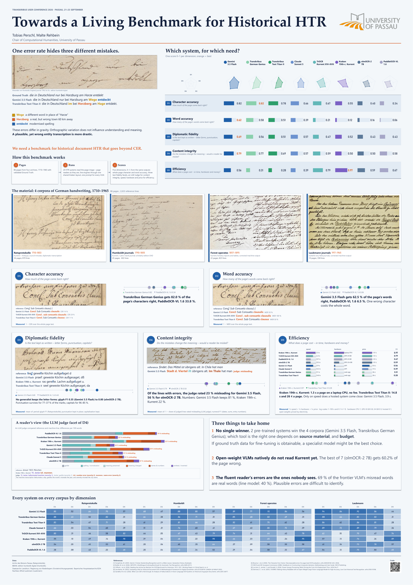

# Towards a Living Benchmark for Historical HTR

Everything behind the poster of that name (Transkribus User Conference 2026, Passau): the data, the code that
scored it, the result tables, and a check that ties what the poster prints back to those tables. The poster's QR
code points here: <https://github.com/Maelkolb/htr-living-benchmark>.



**20 systems** read **86 pages** of German handwriting from **four archives**, from the 18th century to the 20th.
Each system is described by five scores instead of one error rate, because an archive asks more than one question
of a transcription:

| | Dimension | The question |
|---|---|---|
| D1 | Character accuracy | How much of the page came back right? |
| D2 | Word accuracy | How many of the page's words came back right? |
| D3 | Diplomatic fidelity | Is the text kept as written: letter forms, punctuation, capitals? |
| D4 | Content integrity | Do the mistakes change the meaning? Would a reader be misled? |
| D5 | Efficiency | What does a page cost in time, hardware and money? |

In Humboldt's England journal the edition reads „die in Deutschland nur bei Harzburg am Harze entdekt“. Gemini 3.5
Flash reads „…nur bei Harzburg am **Wege** entdeckt“, Transkribus Text Titan II „…Deutschland **im** bei
**Herzberg** am **Hage** entdekt.“ One system moved the plant find to a different real town in the Harz, in a
sentence that reads perfectly. A character error rate cannot tell that apart from a harmless slip; the five dimensions can, and
the LLM judge behind D4 says how often a reader would be misled.

## Reproducing the poster

```bash
uv sync                            # Python 3.12; add --extra gpu (CUDA, Linux or Windows) only to run TrOCR yourself
uv run htrbench data fetch         # the data release (~96 MB) into data/, checksums verified
uv run htrbench score              # archived runs -> results/scores.parquet (one row of counts per page and run)
uv run htrbench aggregate          # counts -> results/tables/*.csv
uv run htrbench check-poster       # every number printed on the poster vs those tables
```

The last command prints `316 of 316 poster values match results/tables`. Scoring is deterministic, so the scores
and tables it rebuilds are the ones committed here, to the last digit; `uv run pytest` asserts exactly that.

`data fetch` downloads from the Google Drive folder named in `configs/data.yaml`. The page images of three of the
four corpora are unpublished archival material, so the folder is shared on request rather than openly
(`docs/DATASETS.md`); with the zip downloaded by hand, `htrbench data fetch --from <zip>` does the rest.

## What is measured, on what

* **86 pages, 2,633 reference lines, four corpora.** Council minutes of the Archiv des Bistums Passau (1736–1803,
  diplomatic transcription), Humboldt's travel journals (1790 and 1799, edition humboldt digital), Bavarian forest
  operates of the Staatsarchiv Landshut and the field journals of Alfred Laubmann. Pages no system could read are
  set aside, and the 86 that remain are the pages every line-up system read, so the line-up is compared on identical
  material; four systems were run on a subset to save money and are compared on whole-page accuracy only.
* **Every system reads the whole page.** Page readers get the image, line engines get the lines of one shared
  Kraken segmentation, and every system that takes a prompt gets the same one. Reference and output are joined in
  reading order and aligned once, so omitted and invented text count and line breaks do not.
* **20 systems**: seven hosted vision-language models, two Transkribus models, two line engines on a laptop and
  nine open-weight models on rented GPUs. Eight of them form the *line-up* that the poster follows through all five
  dimensions; the rest are compared on whole-page accuracy.

`docs/METHODS.md` defines every dimension, facet and statistic. `docs/DATASETS.md` describes the corpora, how their
references were made, and what that implies for the numbers.

## The repository

```
src/htrbench/    schema (the record formats) · eval (normalise, align, match lines, score, judge, aggregate)
                 runners (gemini, anthropic, trocr, kraken, bundle, transkribus) · layout · data · cli
configs/         systems, prices, protocol constants, the data release
prompts/         the transcription prompt and the judge prompt, as the runs used them
results/         scores.parquet and the tables built from it
poster/          the printed poster and numbers.yaml: every value on it, keyed to the table cell it comes from
docs/            METHODS.md, DATASETS.md, references.bib
scripts/         the Modal runner for open-weight models, the Kraken worker and its setup
tests/           pytest; test_release.py runs the whole chain when the data release is present
```

No data file in `results/` is written by hand; `results/tables/README.md` is its column glossary.
`poster/numbers.yaml` is written by hand, because the poster was laid out in PowerPoint: what it prints was
transcribed into that file, and `check-poster` makes 316 comparisons against the tables and the data release —
every printed score, count, rate, price and quoted line, and the rankings the poster asserts. It is the place to
look when a number on the poster needs a source.

## Running a system yourself

Runs need API keys (`.env.example`) and cost money; the archived runs in the data release need neither.

```bash
uv run htrbench run gemini-3.5-flash --budget-usd 2   # resumable; writes data/runs/gemini-3.5-flash__r0/
uv run htrbench judge --dry-run                       # what the D4 judge would cost
```

Open-weight models run elsewhere: `htrbench bundle-export <system>` writes a zip of the pages and the prompt,
`scripts/modal_runner.py` processes it on a rented GPU (`uv sync --extra modal`), `htrbench bundle-import` reads
the results back.
Transkribus models run in the web app: `htrbench transkribus-export` prepares the upload,
`htrbench transkribus-import` reads the PAGE-XML export back in, with the wall time and credits the job was
charged. Both paths produce the same run records as a local run.

Tests: `uv run pytest`.

## Licence

The code is MIT (`LICENSE`). The data release is not: its page images and transcriptions belong to the holding
archives and carry the terms in `docs/DATASETS.md`. The poster is the authors'.

## Citing

Perschl, T. and Rehbein, M. (2026). *Towards a Living Benchmark for Historical HTR*. Poster, Transkribus User
Conference, Passau. Chair of Computational Humanities, University of Passau.
